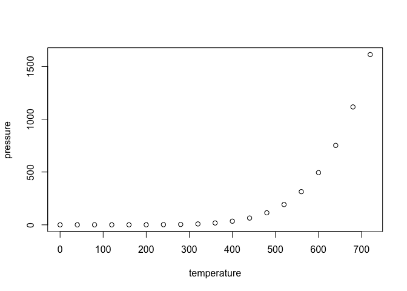

Test driving R markdown with Github
================
Samuel Burke
23/09/2020

## My experiments

Lorem ipsum dolor sit amet, consectetur adipiscing elit. Pellentesque
ipsum est, vehicula malesuada imperdiet sed, pharetra at lorem. Ut
mollis nibh quam, nec aliquet quam imperdiet id. Donec venenatis at
libero at hendrerit. Pellentesque dapibus pharetra accumsan. Proin ex
magna, luctus vitae ultrices a, pellentesque feugiat ligula. Fusce vitae
ipsum vitae lorem dignissim finibus.

``` r
summary(cars)
```

    ##      speed           dist       
    ##  Min.   : 4.0   Min.   :  2.00  
    ##  1st Qu.:12.0   1st Qu.: 26.00  
    ##  Median :15.0   Median : 36.00  
    ##  Mean   :15.4   Mean   : 42.98  
    ##  3rd Qu.:19.0   3rd Qu.: 56.00  
    ##  Max.   :25.0   Max.   :120.00

## Plots

So we do lalalalalalalal alal alala al ala lalla lalalal

``` r
plot(pressure)
```

<!-- -->

``` r
plot(pressure*2)
```

<!-- -->
